# Deliverables

1. **2022-04-30:** a `nom1_nom2.Rmd` file that can be `knitted` under `rstudio`
  - Your file should be knitted without errors and the result should be an html document that can be viewed in a modern browser.
  - The file should contain the code used to generate plots and numerical summaries
  - The file should contain the texts of your comments (either in English or in French)
  - Comments should be written with care, precision and should be concise
  - File `nom1_nom2.Rmd` will be uploaded on `Moodle` on due date
2. A short defense (15 minutes + 15 minutes questions) with slides (May)

You may work in pairs


---

# Objectives

This notebook aims at

  - Working with **tables** (`data.frames`, `tibbles`, `data.tables`, ...) using `dplyr` or any other query language (as provided for example by `data.table`)
  - Exploring a multivariate dataset
  - Using **PCA** to cope with collinearity of explanatory variables
  - Performing simple and multiple linear regression
  - Interpreting numerical and graphic diagnostics
  - Perform variable selection using penalization
  - Assess predictive performance of linear models
  - Transform response and explanatory variables so as to improve interpretation and predictive performance


---


```r
pacman::p_load(readr)
pacman::p_load(dplyr)
pacman::p_load(car)
pacman::p_load(lmtest)
pacman::p_load(ggplot2)
pacman::p_load(GGally)
pacman::p_load(gridExtra)
pacman::p_load(MASS)
pacman::p_load(leaps)
pacman::p_load(glmnet)
pacman::p_load(caret)
pacman::p_load(gbm)
pacman::p_load(knitr)
pacman::p_load(tidyverse)  # metapackage
pacman::p_load(tidymodels) # metapackage
pacman::p_load(vcd)
pacman::p_load(formula)
pacman::p_load(glue)
pacman::p_load(here)
pacman::p_load(rsample)
pacman::p_load(pls)

pacman::p_load(qqplotr)
pacman::p_load(fitdistrplus)
pacman::p_load(metRology)
```


---

# Data loading

Load the data.

```r
data <- read.csv("data4dm.csv")
```


Make columns with less than ten distinct values factors.


```r
data %>%
  summarise_all(n_distinct)
```

```
##   X1  X2  X3 X4   X5   X6  X7  X8  Y
## 1  3 134 111 51 2429 1515 880 926 28
```

```r
data <- data %>%
  mutate(X1 = as.factor(X1))
```


---

# Sanity checks

## Are there missing values?

All numerical entries should be positive. $0$ is a surrogate for `NA`.


```r
colSums(data == 0)
```

```
## X1 X2 X3 X4 X5 X6 X7 X8  Y 
##  0  0  0  2  0  0  0  0  0
```


## Numerical summary for categorical columns

The numerical summary is a contingency table


```r
cat_cols <- unlist(lapply(data, is.factor))

summary(data[,cat_cols])
```

```
##    A    B    C 
## 1307 1342 1527
```


## Numerical summary for numerical columns

For each column, a numerical summary contains as much information as the output of function `summary()` (when applied to a numeric vector).

```r
num_cols <- unlist(lapply(data, is.numeric))
summary(data[,num_cols])
```

```
##        X2              X3               X4               X5       
##  Min.   : 15.0   Min.   : 11.00   Min.   :  0.00   Min.   :  0.4  
##  1st Qu.: 90.0   1st Qu.: 70.00   1st Qu.: 23.00   1st Qu.: 88.3  
##  Median :109.0   Median : 85.00   Median : 28.00   Median :159.9  
##  Mean   :104.8   Mean   : 81.58   Mean   : 27.91   Mean   :165.8  
##  3rd Qu.:123.0   3rd Qu.: 96.00   3rd Qu.: 33.00   3rd Qu.:230.7  
##  Max.   :163.0   Max.   :130.00   Max.   :226.00   Max.   :565.1  
##        X6               X7               X8               Y         
##  Min.   :  0.20   Min.   :  0.10   Min.   :  0.30   Min.   : 1.000  
##  1st Qu.: 37.20   1st Qu.: 18.68   1st Qu.: 26.00   1st Qu.: 8.000  
##  Median : 67.20   Median : 34.20   Median : 46.80   Median : 9.000  
##  Mean   : 71.88   Mean   : 36.12   Mean   : 47.77   Mean   : 9.932  
##  3rd Qu.:100.40   3rd Qu.: 50.60   3rd Qu.: 65.80   3rd Qu.:11.000  
##  Max.   :297.60   Max.   :152.00   Max.   :201.00   Max.   :29.000
```

```r
for(c in data[2:9]){plot(density(c))}
```

<!-- --><!-- --><!-- --><!-- --><!-- --><!-- --><!-- --><!-- -->

Make any relevant comment
> Columns have a median almost equal to the mean, they look quite well  distributed between their min and max. 

## Pair plots

Use `ggpairs` from `GGally` to get a _big picture_ of the dataset

Display linear correlations between the numerical columns (packages `corrr` or `corrplot` may be useful)

```r
ggpairs(data[,num_cols])
```

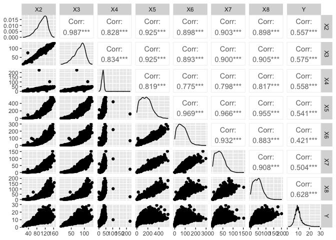<!-- -->

## Compare the conditional distributions of the numerical columns given the categories from categorical columns

Perform qqplots (not normal qqplots), compute two-sample Kolmogorov-Smirnov statistics


```r
data %>% ggplot(aes(x=X4,col=X1))+
    geom_density() +
    ggtitle("Conditional density of X4 under X1")
```

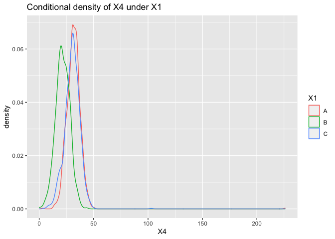<!-- -->


```r
data  %>% filter(X1=="A") %>% dplyr::select(X4) %>% unlist %>% 
    density()-> d1
data  %>% filter(X1=="C") %>% dplyr::select(X4) %>% unlist %>% 
    density()-> d2
    print("--- Kolmogorov-Smirnov's test between conditionnal distributions of X4 and X1 values of A and C")
```

```
## [1] "--- Kolmogorov-Smirnov's test between conditionnal distributions of X4 and X1 values of A and C"
```

```r
    ks.test(c(d1$x,d1$y),c(d2$x,d2$y)) %>% print()
```

```
## 
## 	Two-sample Kolmogorov-Smirnov test
## 
## data:  c(d1$x, d1$y) and c(d2$x, d2$y)
## D = 0.26562, p-value < 2.2e-16
## alternative hypothesis: two-sided
```


```r
data_without_b <- filter(data,X1 != "B")
qq(X1 ~ X4, aspect = 1, data = data_without_b)
```

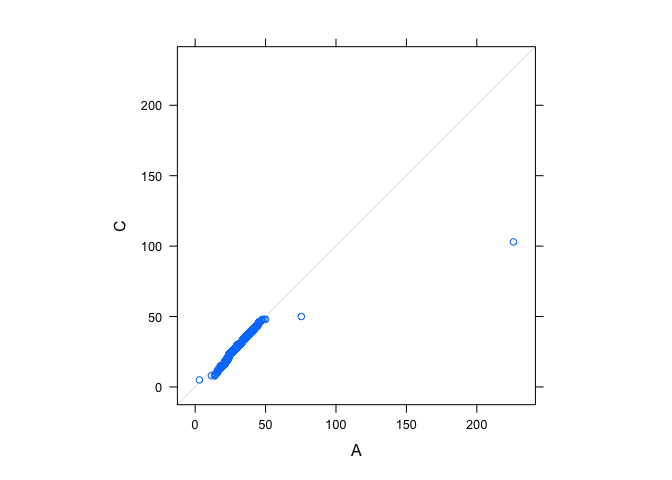<!-- -->

> As we can see, even if the conditional distributions of X4 under X1=A and X2=C look very similar, when we perform a Kolmogorov-Smirnov's test, we get a very low p-value (< 2.2e-16) which means that both samples can't result from the same distribution. On the QQ-Plot, we can see that most of the quantiles are the same but the two last ones are far away from each other.


```r
data  %>% filter(X1=="A") %>% dplyr::select(X5) %>% unlist %>% 
    density()-> d1
data  %>% filter(X1=="C") %>% dplyr::select(X5) %>% unlist %>% 
    density()-> d2
    print("--- Kolmogorov-Smirnov's test between conditionnal distributions of X5 and X1 values of A and C")
```

```
## [1] "--- Kolmogorov-Smirnov's test between conditionnal distributions of X5 and X1 values of A and C"
```

```r
    ks.test(c(d1$x,d1$y),c(d2$x,d2$y)) %>% print()
```

```
## 
## 	Two-sample Kolmogorov-Smirnov test
## 
## data:  c(d1$x, d1$y) and c(d2$x, d2$y)
## D = 0.035156, p-value = 0.5515
## alternative hypothesis: two-sided
```


```r
data_without_b <- filter(data,X1 != "B")
qq(X1 ~ X5, aspect = 1, data = data_without_b)
```

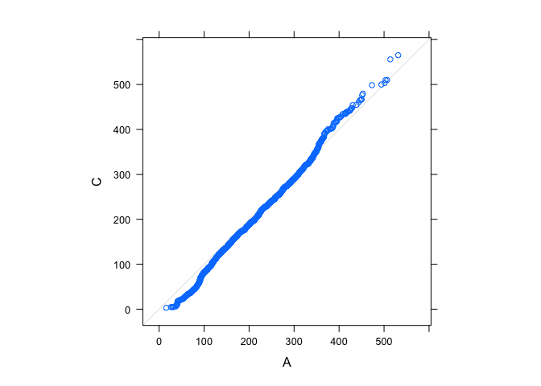<!-- -->

> However, there are some variables were the "conditional" samples may come from the same distribution. For example, when we perform a Kolmogorov-Smirnov's test on samples of X5 under X1=A et X5 under X1=C we found a p-value of 0.55 which means that we definetely can't reject the null hypothesis for X5.

Is it worth collapsing some qualitative categories (use `fct_collapse()` from `forcats`)?

> As we can see the conditional distribution between A and C is very close, and with the Kolmogorov-Smirnov test results( low values with a hight probabilty to occure) we don't reject the hipotesis that conditional distrubution between A and C are made by the same law. To conclude, we can merge the category 'A' and 'C'


```r
new_factors <- fct_collapse(data$X1, X = c('A', 'C'), Y = c('B'))
data$X1 <- new_factors
```


```r
head(data)
```

```
##   X1  X2  X3 X4    X5    X6   X7   X8  Y
## 1  X  65  46 18  29.4  12.0  6.8  9.0  4
## 2  X 118  95 28 195.4  92.5 40.5 55.0 10
## 3  X  83  62 18  64.9  26.1 14.7 23.0  8
## 4  X 136 108 42 357.7 166.9 81.6 87.4 13
## 5  X  72  59 21  48.2  17.3 10.6 19.0  8
## 6  X  33  25  8   4.9   1.9  0.9  1.6  4
```

## Track functional dependencies

Perform linear regression of  column `X5` with respect to columns `X6`, `X7`, `X8`.


```r
i<-6

for(x in data %>% dplyr::select(X6,X7,X8)){
  data %>%
  ggplot() +
  aes(x=x) +
  aes(y=X5) +
  geom_smooth(
    color='red',
    method = "lm",
    formula = y ~ x,
    se=FALSE
  )+
  geom_point(
    color= '#41CAF7',
    alpha = .2
  ) +
  ggtitle(sprintf("Linear regression of X5 column with respect to column %s ",colnames(data)[i]))->p
  p %>% print()
  i<-i+1
  #Sys.sleep(2)
}
```

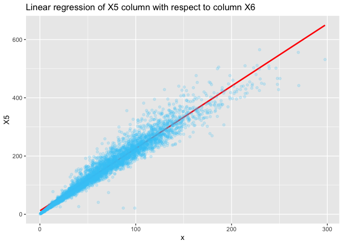<!-- -->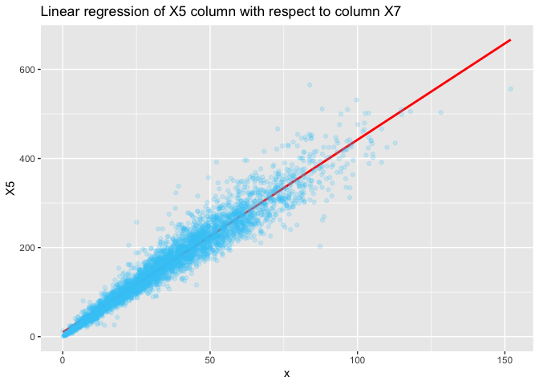<!-- -->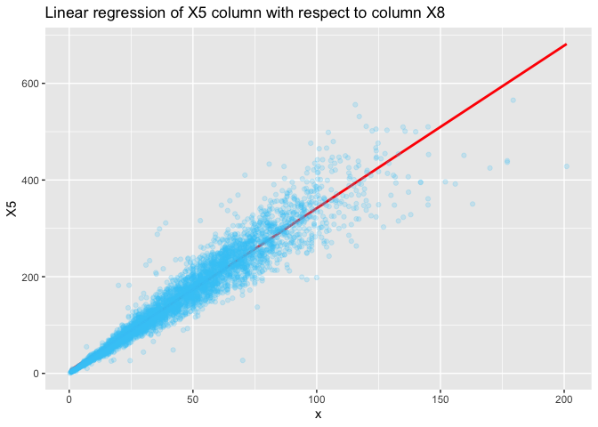<!-- -->


Is it worth considering regression of `Y` with respect to `X5`?

> The corelation factor between the two columns is very low (0.541), so no, it's not a good idea.

---

# PCA

Perform PCA on the explanatory variables (`X1, ..., X8`).

```r
data_pca <-data %>% dplyr::select(!c(X1,Y))
pca<- data_pca %>% prcomp(scale = T, center = T)
data_pca %>%
  broom::tidy(matrix="pcs") %>%
  knitr::kable(format="markdown", digits=2)
```


|column |    n|   mean|    sd| median| trimmed|   mad|  min|   max| range|  skew| kurtosis|   se|
|:------|----:|------:|-----:|------:|-------:|-----:|----:|-----:|-----:|-----:|--------:|----:|
|X2     | 4176| 104.80| 24.02| 109.00|  106.50| 16.00| 15.0| 163.0| 148.0| -0.64|     3.06| 0.37|
|X3     | 4176|  81.58| 19.85|  85.00|   82.94| 13.00| 11.0| 130.0| 119.0| -0.61|     2.95| 0.31|
|X4     | 4176|  27.91|  8.37|  28.00|   28.05|  5.00|  0.0| 226.0| 226.0|  3.13|    78.95| 0.13|
|X5     | 4176| 165.76| 98.08| 159.95|  159.93| 71.25|  0.4| 565.1| 564.7|  0.53|     2.97| 1.52|
|X6     | 4176|  71.88| 44.40|  67.20|   68.79| 31.70|  0.2| 297.6| 297.4|  0.72|     3.59| 0.69|
|X7     | 4176|  36.12| 21.92|  34.20|   34.67| 15.90|  0.1| 152.0| 151.9|  0.59|     3.08| 0.34|
|X8     | 4176|  47.77| 27.84|  46.80|   46.11| 19.90|  0.3| 201.0| 200.7|  0.62|     3.53| 0.43|

```r
share_variance <- broom::tidy(data_pca, "pcs")[["percent"]]
pca<- broom::augment(pca, data_pca)
pca %>%
  ggplot() +
  aes(x=.fittedPC1, y=.fittedPC2) +
  aes(colour=data$X1) +
  geom_point() +
  ggtitle("Explanatory variables  projected on first two principal axes") +
  xlab(paste("PC1 (", share_variance[1], "%)", sep="")) +
  ylab(paste("PC2 (", share_variance[2], "%)", sep="")) ->p


  


p
```

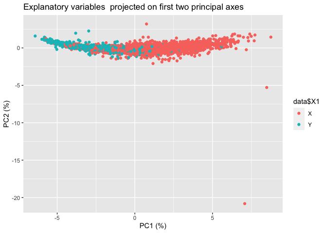<!-- -->

```r
#pca
```


```r
myPr <- prcomp(data[,2:8], scale=T)
biplot(myPr, scale = 0)
```

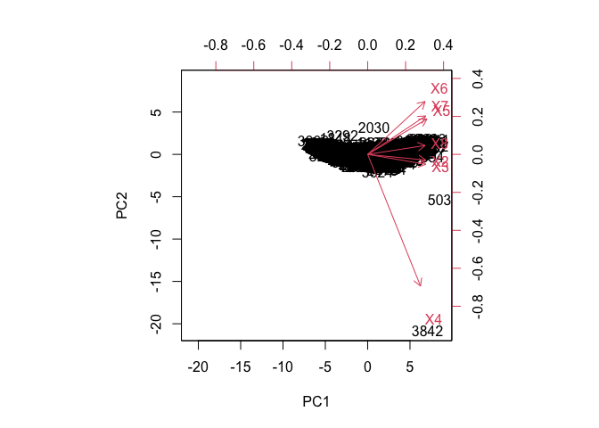<!-- -->

Is it possible to connect qualitative variables with PCA (which is performed on quantitative columns)?

> Given the graph above, it's possible to connect the variables X7 and X5 as well as variables X2 and X3.


---

# Regression framework

The data were not collected from experimental results. They were rather collected as a collection of  i.i.d. multivariate observations (this corresponds to the _random design_ setting whereas we have studied the _fixed design_ framework during the course). We aim at predicting the value of $Y$ from $X^1, \ldots, X^8$, that is to find a function $f$ such that
$$\mathbb{E}\left[\left(Y - f(X^1, \ldots, X^8)\right)^2\right]$$ is minimized.

If there is no prescription about $f$ (beyond measurability and square integrability), the minimizer is (a version of) the conditional expectation of $Y$ with respect to $\sigma(X^1, \ldots, X^8)$.

We will look for functions that satisfy criteria.

1. First we look for simple linear functions: $a X^i +b$ for $i \in \{1, \ldots, 8\}$ and
$X^i$ a numerical variable.
2. Second, we look at the best mutivariate linear function $\sum_{i=1} \beta_i X^i$ where qualitative columns have been properly encoded.
3. We look at the mutivariate linear functions of the _principal components_: $\sum_{i=1}^q \beta_i \widetilde{X}^i$ where the $\widetilde{X}^i$ are the principal component columns (use `broom::augment()` to retrieve them for `prcomp` objects).
4. We attempt to perform _variable selection_
5. If diagnostics (either numerical or graphical) suggest that, conditionally on the design matrix, the homoschedastic Gaussian noise assumptions are violated, we may transform the data, look for a prediction of $(Y^{\lambda} - 1)/\lambda$ for some $\lambda \in \mathbb{R}$ (notice that $Y$ is positive), with the convention that for $\lambda =0$, $(Y^{\lambda} - 1)/\lambda=\log(Y)$.
6. In a further step, we look for coefficients that minimize:
$$\sum_{i=1}^n \left( (Y_i^{\lambda}-1)/\lambda - \left(\beta_0 + \sum_{k=1}^d \sum_{j=1}^8 \beta_{j,k} (X^i)^k \right)\right)^2$$ for $d=3$.


---

# Split the data

As we dive into predictive modelling, it is useful to split the data into two parts: a training set (two thirds of observations) and a testing set (one third of observations).  This splitting is best performed at random. Try to balance evenly the different levels of the categorical variables in the training and testing set.

Package `rsample` could be useful.


```r
set.seed(130)
#MonterCarlo sample
data %>% mc_cv(prop= 2/3 ,times=1)-> sample

sample$splits[[1]] %>% assessment()->testing_set
sample$splits[[1]] %>% analysis()->training_set

quant_col <- data %>% dplyr::select(!c(X1,Y)) %>% colnames()
```


---

# Simple linear regressions

Perform simple linear regressions of $Y$ with respect to each quantitative numerical column.


```r
lr_col <-c()
i<-2
mean_error <- c()
for(c in training_set[quant_col]){
  print(sprintf("---- Linear regression with %s column ------",colnames(data)[i]))
  lr<-lm(training_set$Y~c)
  lr_col<-c(lr_col,lr)
  mean_error <- c(mean_error, mean(residuals(lr)^2))
  summary(lr) %>% print()
}
```

```
## [1] "---- Linear regression with X2 column ------"
## 
## Call:
## lm(formula = training_set$Y ~ c)
## 
## Residuals:
##     Min      1Q  Median      3Q     Max 
## -5.8681 -1.6545 -0.7221  0.8117 16.7387 
## 
## Coefficients:
##             Estimate Std. Error t value Pr(>|t|)    
## (Intercept) 2.227199   0.224100   9.938   <2e-16 ***
## c           0.073037   0.002087  35.001   <2e-16 ***
## ---
## Signif. codes:  0 '***' 0.001 '**' 0.01 '*' 0.05 '.' 0.1 ' ' 1
## 
## Residual standard error: 2.645 on 2782 degrees of freedom
## Multiple R-squared:  0.3057,	Adjusted R-squared:  0.3055 
## F-statistic:  1225 on 1 and 2782 DF,  p-value: < 2.2e-16
## 
## [1] "---- Linear regression with X2 column ------"
## 
## Call:
## lm(formula = training_set$Y ~ c)
## 
## Residuals:
##     Min      1Q  Median      3Q     Max 
## -5.1132 -1.6543 -0.6935  0.8166 16.0704 
## 
## Coefficients:
##             Estimate Std. Error t value Pr(>|t|)    
## (Intercept) 2.394213   0.208189   11.50   <2e-16 ***
## c           0.091779   0.002483   36.97   <2e-16 ***
## ---
## Signif. codes:  0 '***' 0.001 '**' 0.01 '*' 0.05 '.' 0.1 ' ' 1
## 
## Residual standard error: 2.6 on 2782 degrees of freedom
## Multiple R-squared:  0.3294,	Adjusted R-squared:  0.3292 
## F-statistic:  1367 on 1 and 2782 DF,  p-value: < 2.2e-16
## 
## [1] "---- Linear regression with X2 column ------"
## 
## Call:
## lm(formula = training_set$Y ~ c)
## 
## Residuals:
##     Min      1Q  Median      3Q     Max 
## -41.633  -1.694  -0.697   0.895  15.494 
## 
## Coefficients:
##             Estimate Std. Error t value Pr(>|t|)    
## (Intercept) 4.282553   0.172347   24.85   <2e-16 ***
## c           0.200665   0.005915   33.93   <2e-16 ***
## ---
## Signif. codes:  0 '***' 0.001 '**' 0.01 '*' 0.05 '.' 0.1 ' ' 1
## 
## Residual standard error: 2.67 on 2782 degrees of freedom
## Multiple R-squared:  0.2927,	Adjusted R-squared:  0.2924 
## F-statistic:  1151 on 1 and 2782 DF,  p-value: < 2.2e-16
## 
## [1] "---- Linear regression with X2 column ------"
## 
## Call:
## lm(formula = training_set$Y ~ c)
## 
## Residuals:
##     Min      1Q  Median      3Q     Max 
## -6.0637 -1.7240 -0.6693  0.9463 15.7962 
## 
## Coefficients:
##              Estimate Std. Error t value Pr(>|t|)    
## (Intercept) 7.0175297  0.0990532   70.85   <2e-16 ***
## c           0.0172628  0.0005144   33.56   <2e-16 ***
## ---
## Signif. codes:  0 '***' 0.001 '**' 0.01 '*' 0.05 '.' 0.1 ' ' 1
## 
## Residual standard error: 2.679 on 2782 degrees of freedom
## Multiple R-squared:  0.2882,	Adjusted R-squared:  0.2879 
## F-statistic:  1126 on 1 and 2782 DF,  p-value: < 2.2e-16
## 
## [1] "---- Linear regression with X2 column ------"
## 
## Call:
## lm(formula = training_set$Y ~ c)
## 
## Residuals:
##     Min      1Q  Median      3Q     Max 
## -6.7255 -1.8565 -0.7679  1.0195 17.3365 
## 
## Coefficients:
##             Estimate Std. Error t value Pr(>|t|)    
## (Intercept) 7.719521   0.102903   75.02   <2e-16 ***
## c           0.029953   0.001215   24.66   <2e-16 ***
## ---
## Signif. codes:  0 '***' 0.001 '**' 0.01 '*' 0.05 '.' 0.1 ' ' 1
## 
## Residual standard error: 2.876 on 2782 degrees of freedom
## Multiple R-squared:  0.1794,	Adjusted R-squared:  0.1791 
## F-statistic: 608.2 on 1 and 2782 DF,  p-value: < 2.2e-16
## 
## [1] "---- Linear regression with X2 column ------"
## 
## Call:
## lm(formula = training_set$Y ~ c)
## 
## Residuals:
##     Min      1Q  Median      3Q     Max 
## -6.2763 -1.7276 -0.7251  0.9825 16.7712 
## 
## Coefficients:
##             Estimate Std. Error t value Pr(>|t|)    
## (Intercept) 7.256244   0.099414   72.99   <2e-16 ***
## c           0.072500   0.002349   30.86   <2e-16 ***
## ---
## Signif. codes:  0 '***' 0.001 '**' 0.01 '*' 0.05 '.' 0.1 ' ' 1
## 
## Residual standard error: 2.74 on 2782 degrees of freedom
## Multiple R-squared:  0.255,	Adjusted R-squared:  0.2547 
## F-statistic: 952.3 on 1 and 2782 DF,  p-value: < 2.2e-16
## 
## [1] "---- Linear regression with X2 column ------"
## 
## Call:
## lm(formula = training_set$Y ~ c)
## 
## Residuals:
##     Min      1Q  Median      3Q     Max 
## -5.8096 -1.5774 -0.5633  0.9343 13.0908 
## 
## Coefficients:
##             Estimate Std. Error t value Pr(>|t|)    
## (Intercept) 6.496965   0.093263   69.66   <2e-16 ***
## c           0.071089   0.001695   41.93   <2e-16 ***
## ---
## Signif. codes:  0 '***' 0.001 '**' 0.01 '*' 0.05 '.' 0.1 ' ' 1
## 
## Residual standard error: 2.485 on 2782 degrees of freedom
## Multiple R-squared:  0.3872,	Adjusted R-squared:  0.387 
## F-statistic:  1758 on 1 and 2782 DF,  p-value: < 2.2e-16
```

```r
mean_error
```

```
## [1] 6.992711 6.753967 7.124277 7.169313 8.264981 7.503594 6.171752
```


Comment on each numerical summary and comments the diagnostic plots.
> the regression isn't neat, values to predict aren't linear with respect  quantitative columns.

Use the coefficients estimated on the training set to predict $Y$ on the testing set. Compare the training error and the testing error.


```r
mean_error_testing <- c()
for(c in training_set[quant_col]){
  lr<-lm(Y~c, data=training_set)
  p <- predict(lr, newdata = testing_set)
  error <- testing_set$Y - p

  mean_error_testing <- c(mean_error_testing, mean(error^2))
}
mean_error_testing
```

```
## [1] 13.73212 13.94719 13.64605 13.68535 12.68816 13.39617 14.58230
```
> As we can expect the testing error is bigger than the training one. That can simply be explain by the fact that the model is created such as it minimizes the training error.


What is your best predictor?

> X6 seems to be the best predictor with this training dataset.

Do you think that the Gaussian Linear Modelling assumptions are satisfied?


```r
X6_lr <- lm(Y ~ X6, data = training_set)

plot(X6_lr)
```

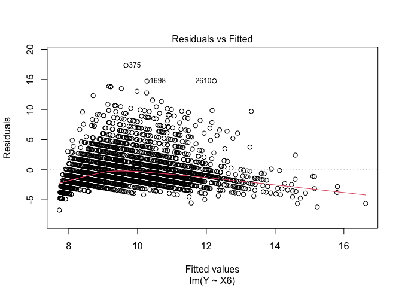<!-- -->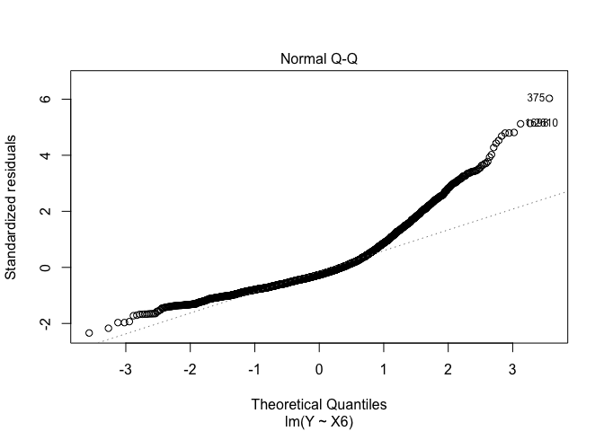<!-- -->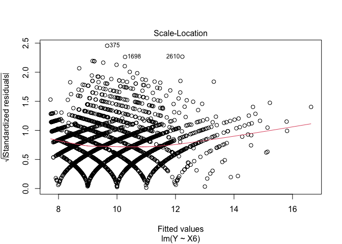<!-- -->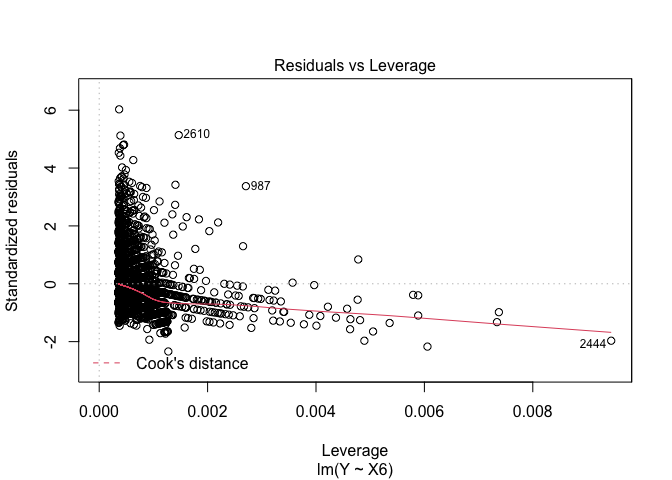<!-- -->


> As we can see we don't have the normality of the error (Normal Q-Q plot). The Gaussian Linear Modelling assumptions are not satisfied.


---

# Multiple linear regression

Perform linear regression of $Y$ with respect to all predictors


```r
lm_multi <- lm(Y ~ ., data=training_set)
mean(residuals(lm_multi)^2)
```

```
## [1] 4.716779
```

Which coefficients are deemed non-zero?


```r
lm_multi
```

```
## 
## Call:
## lm(formula = Y ~ ., data = training_set)
## 
## Coefficients:
## (Intercept)          X1Y           X2           X3           X4           X5  
##     4.13217     -0.86581     -0.01608      0.07311      0.04209      0.04713  
##          X6           X7           X8  
##    -0.10144     -0.05118      0.04040
```


Perform ANOVA testing to compare the full model (all predictors) with respect to your best
simple model (one predictor). Comment.

```r
set.seed(4590) 

anova_full <- aov(Y ~., data=data %>% dplyr::select(!X1))
anova_best <-aov(Y ~X6, data=data)
print("----------------Full model anova test---------------")
```

```
## [1] "----------------Full model anova test---------------"
```

```r
summary(anova_full)
```

```
##               Df Sum Sq Mean Sq  F value   Pr(>F)    
## X2             1  13466   13466 2742.276  < 2e-16 ***
## X3             1   1054    1054  214.649  < 2e-16 ***
## X4             1    928     928  188.902  < 2e-16 ***
## X5             1      1       1    0.123    0.726    
## X6             1   6633    6633 1350.764  < 2e-16 ***
## X7             1    556     556  113.190  < 2e-16 ***
## X8             1    281     281   57.158 4.92e-14 ***
## Residuals   4168  20467       5                      
## ---
## Signif. codes:  0 '***' 0.001 '**' 0.01 '*' 0.05 '.' 0.1 ' ' 1
```

```r
print("------------Best predictor X6 anova test------------")
```

```
## [1] "------------Best predictor X6 anova test------------"
```

```r
summary(anova_best)
```

```
##               Df Sum Sq Mean Sq F value Pr(>F)    
## X6             1   7699    7699   900.5 <2e-16 ***
## Residuals   4174  35686       9                   
## ---
## Signif. codes:  0 '***' 0.001 '**' 0.01 '*' 0.05 '.' 0.1 ' ' 1
```

> Comment: the residuals number is bigger with the best predictor (4168<4174) as well as with the sum square residuals (20 467<35 686). The full model could do an overfit. We can see that the F-value of X6 with the best predictor is less than the  F value with all predictors (900<1350) this could mean that with the full model, the variation is more credible by the independent variables than with only the best predictor. 

> We conclude that the full model explains better how Y values are affected by the full predicors. 


Use again the coefficients estimated on the training set to predict $Y$ on the testing set. Compare the training error and the testing error.


```r
p2 <- predict(lm_multi, newdata = testing_set)
error2 <- testing_set$Y - p2
sqrt(mean(error2^2))
```

```
## [1] 2.2309
```
> The testing and training error are way closer than in the simple linear regression. We still have the relation training_error < testing_error.

---

# Regression with respect to principal components

Perform linear regression of $Y$ with respect to one, two, ... principal components computed on the training set.

```r
data_with_PCA <- cbind(data, myPr$x[,1:7])
```


```r
data_with_PCA %>% mc_cv(prop= 2/3 ,times=1)-> sample2

sample2$splits[[1]] %>% assessment()->PCA.testing_set
sample2$splits[[1]] %>% analysis()->PCA.training_set
```


```r
lm_pr.1 <- lm(Y ~ PC1, data=PCA.training_set)
lm_pr.2 <- lm(Y ~ PC1 + PC2, data=PCA.training_set)
lm_pr.3 <- lm(Y ~ PC1 + PC2 + PC3, data=PCA.training_set)
lm_pr.4 <- lm(Y ~ PC1 + PC2 + PC3 + PC4, data=PCA.training_set)
lm_pr.5 <- lm(Y ~ PC1 + PC2 + PC3 + PC4 + PC5, data=PCA.training_set)
lm_pr.6 <- lm(Y ~ PC1 + PC2 + PC3 + PC4 + PC5 + PC6, data=PCA.training_set)
lm_pr.7 <- lm(Y ~ PC1 + PC2 + PC3 + PC4 + PC5 + PC6 + PC7, data=PCA.training_set)
```


```r
plot(lm_pr.1)
```

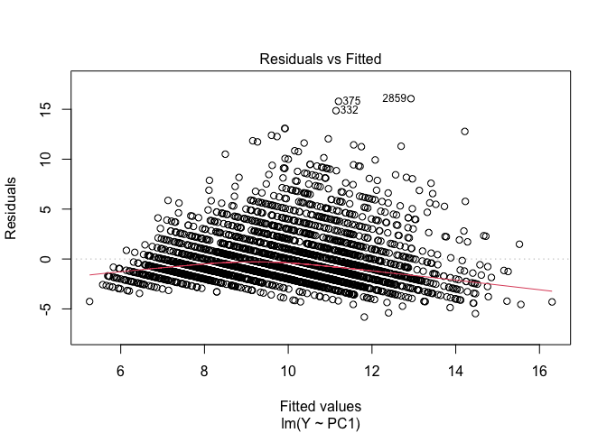<!-- -->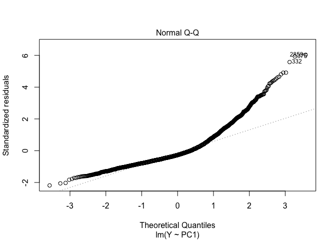<!-- -->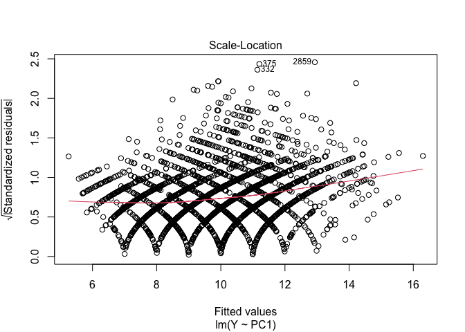<!-- -->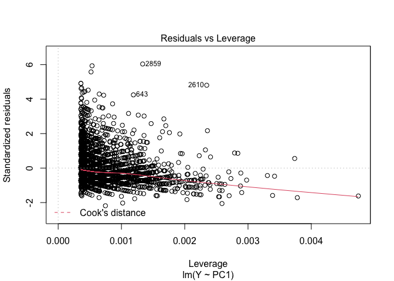<!-- -->


```r
pca_regression_model <- pcr(Y ~ X2 + X3 + X4 + X5 + X6 + X7 + X8, data=training_set, scale=TRUE, validation="CV")
summary(pca_regression_model)
```

```
## Data: 	X dimension: 2784 7 
## 	Y dimension: 2784 1
## Fit method: svdpc
## Number of components considered: 7
## 
## VALIDATION: RMSEP
## Cross-validated using 10 random segments.
##        (Intercept)  1 comps  2 comps  3 comps  4 comps  5 comps  6 comps
## CV           3.175    2.623    2.616    2.779    2.310    2.291    2.285
## adjCV        3.175    2.623    2.615    2.771    2.306    2.288    2.282
##        7 comps
## CV       2.245
## adjCV    2.241
## 
## TRAINING: % variance explained
##    1 comps  2 comps  3 comps  4 comps  5 comps  6 comps  7 comps
## X    90.40    94.83    97.29    98.83    99.74    99.91   100.00
## Y    31.79    34.59    35.52    49.46    49.94    50.18    52.09
```

How many principal components would you use to perform prediction?  (`stepAIC`  from `MASS` can be useful)


```r
var_explained_df <- data.frame(PC= paste0("PC",1:7),
                               var_explained=(myPr$sdev)^2/sum((myPr$sdev)^2))
```


```r
var_explained_df %>% 
  ggplot(aes(x=PC, y=var_explained, group=1)) +
  geom_point()+
  geom_line()+
  ggtitle("Variance explained by each principal component")+
  ylab("Variance explained")
```

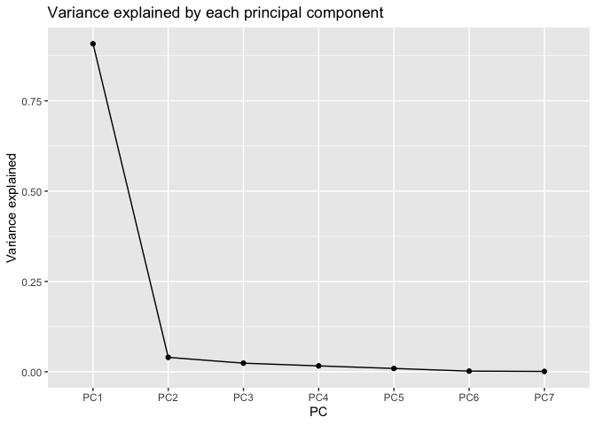<!-- -->


```r
plot(pca_regression_model, "validation")
```

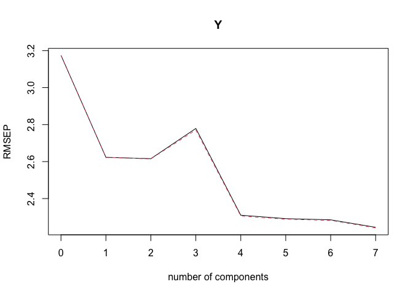<!-- -->

```r
summary(lm_pr.2)
```

```
## 
## Call:
## lm(formula = Y ~ PC1 + PC2, data = PCA.training_set)
## 
## Residuals:
##     Min      1Q  Median      3Q     Max 
## -5.6804 -1.5739 -0.5305  0.8617 16.7310 
## 
## Coefficients:
##             Estimate Std. Error t value Pr(>|t|)    
## (Intercept)  9.92016    0.04733  209.60   <2e-16 ***
## PC1          0.74276    0.01888   39.34   <2e-16 ***
## PC2         -2.25559    0.11500  -19.61   <2e-16 ***
## ---
## Signif. codes:  0 '***' 0.001 '**' 0.01 '*' 0.05 '.' 0.1 ' ' 1
## 
## Residual standard error: 2.497 on 2781 degrees of freedom
## Multiple R-squared:  0.4025,	Adjusted R-squared:  0.4021 
## F-statistic: 936.7 on 2 and 2781 DF,  p-value: < 2.2e-16
```
> We choose the first two principal components. It assures us a Root Mean Square Error of 2.629 which is slightly higher than the one for multilinear regression.


Use again the coefficients estimated on the training set to predict $Y$ on the testing set. Compare the training error and the testing error.


```r
predictions <- predict(pca_regression_model, testing_set, ncomp = 4)
```


```r
mean((predictions - testing_set$Y)^2)
```

```
## [1] 5.286455
```

> The training error and the testing error (RMSE) are still pretty close

Package `broom` offers function to manipulate the outputs of `prcomp`.

---

# Variable selection

Go back to Multiple linear regression with respect to the original variables. Use `stepAIC`  from `MASS` to pick a subset of predictors.


```r
lm_multi2 <- lm(Y ~ ., data = training_set)
step <- stepAIC(lm_multi2, direction="both", trace=FALSE)
step$anova
```

```
## Stepwise Model Path 
## Analysis of Deviance Table
## 
## Initial Model:
## Y ~ X1 + X2 + X3 + X4 + X5 + X6 + X7 + X8
## 
## Final Model:
## Y ~ X1 + X2 + X3 + X4 + X5 + X6 + X7 + X8
## 
## 
##   Step Df Deviance Resid. Df Resid. Dev      AIC
## 1                       2775   13131.51 4336.335
```


```r
stats::step(lm_multi2, direction="backward")
```

```
## Start:  AIC=4336.34
## Y ~ X1 + X2 + X3 + X4 + X5 + X6 + X7 + X8
## 
##        Df Sum of Sq   RSS    AIC
## <none>              13132 4336.3
## - X2    1      9.79 13141 4336.4
## - X4    1    113.73 13245 4358.3
## - X3    1    132.47 13264 4362.3
## - X8    1    151.94 13284 4366.4
## - X7    1    198.94 13330 4376.2
## - X1    1    302.24 13434 4397.7
## - X5    1    496.44 13628 4437.6
## - X6    1   1791.11 14923 4690.3
```

```
## 
## Call:
## lm(formula = Y ~ X1 + X2 + X3 + X4 + X5 + X6 + X7 + X8, data = training_set)
## 
## Coefficients:
## (Intercept)          X1Y           X2           X3           X4           X5  
##     4.13217     -0.86581     -0.01608      0.07311      0.04209      0.04713  
##          X6           X7           X8  
##    -0.10144     -0.05118      0.04040
```

> We can see that the subset that minimizes the AIC is the entire set of predictors (<none>).


```r
new_lm <- lm(Y ~ X1 + X3 + X4 + X5 + X6 + X7 + X8, data=training_set)
#step(new_lm, direction="backward")
```


In order to optimize the predictive capabilities of your model (perforance on the testing set), you may try to use _cross-validation_ to identify a good set of predictors.

```r
#cross-validation
cross_val <- trainControl(method = "LOOCV", number = 7, verboseIter =FALSE )


#training the model
cross_lm<-caret::train(form=Y~., data=training_set, method="lm", trControl= cross_val)

#final model (with best parameters)
cross_lm$finalModel
```

```
## 
## Call:
## lm(formula = .outcome ~ ., data = dat)
## 
## Coefficients:
## (Intercept)          X1Y           X2           X3           X4           X5  
##     4.13217     -0.86581     -0.01608      0.07311      0.04209      0.04713  
##          X6           X7           X8  
##    -0.10144     -0.05118      0.04040
```

```r
cross_lm
```

```
## Linear Regression 
## 
## 2784 samples
##    8 predictor
## 
## No pre-processing
## Resampling: Leave-One-Out Cross-Validation 
## Summary of sample sizes: 2783, 2783, 2783, 2783, 2783, 2783, ... 
## Resampling results:
## 
##   RMSE    Rsquared   MAE     
##   2.2172  0.5124542  1.579227
## 
## Tuning parameter 'intercept' was held constant at a value of TRUE
```


```r
stats::step(cross_lm$finalModel, direction="backward")
```

```
## Start:  AIC=4336.34
## .outcome ~ X1Y + X2 + X3 + X4 + X5 + X6 + X7 + X8
## 
##        Df Sum of Sq   RSS    AIC
## <none>              13132 4336.3
## - X2    1      9.79 13141 4336.4
## - X4    1    113.73 13245 4358.3
## - X3    1    132.47 13264 4362.3
## - X8    1    151.94 13284 4366.4
## - X7    1    198.94 13330 4376.2
## - X1Y   1    302.24 13434 4397.7
## - X5    1    496.44 13628 4437.6
## - X6    1   1791.11 14923 4690.3
```

```
## 
## Call:
## lm(formula = .outcome ~ X1Y + X2 + X3 + X4 + X5 + X6 + X7 + X8, 
##     data = dat)
## 
## Coefficients:
## (Intercept)          X1Y           X2           X3           X4           X5  
##     4.13217     -0.86581     -0.01608      0.07311      0.04209      0.04713  
##          X6           X7           X8  
##    -0.10144     -0.05118      0.04040
```

```r
#stepAIC on the last model: UAH comment: meeeeh
stepAIC(cross_lm$finalModel)
```

```
## Start:  AIC=4336.34
## .outcome ~ X1Y + X2 + X3 + X4 + X5 + X6 + X7 + X8
## 
##        Df Sum of Sq   RSS    AIC
## <none>              13132 4336.3
## - X2    1      9.79 13141 4336.4
## - X4    1    113.73 13245 4358.3
## - X3    1    132.47 13264 4362.3
## - X8    1    151.94 13284 4366.4
## - X7    1    198.94 13330 4376.2
## - X1Y   1    302.24 13434 4397.7
## - X5    1    496.44 13628 4437.6
## - X6    1   1791.11 14923 4690.3
```

```
## 
## Call:
## lm(formula = .outcome ~ X1Y + X2 + X3 + X4 + X5 + X6 + X7 + X8, 
##     data = dat)
## 
## Coefficients:
## (Intercept)          X1Y           X2           X3           X4           X5  
##     4.13217     -0.86581     -0.01608      0.07311      0.04209      0.04713  
##          X6           X7           X8  
##    -0.10144     -0.05118      0.04040
```
> We still can't drop any variable.


```r
plot(lm_multi)
```

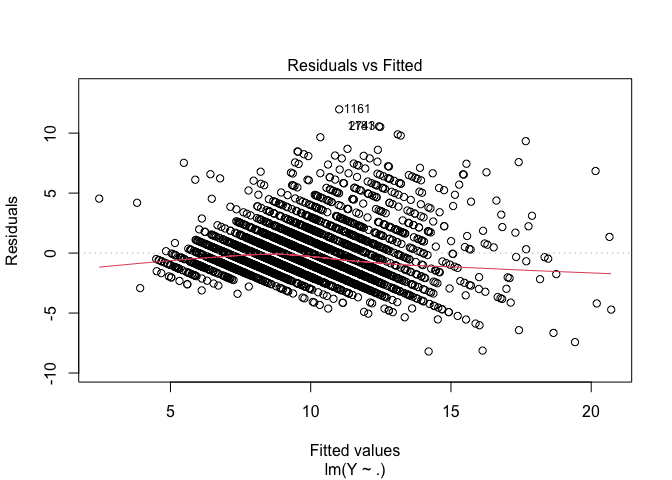<!-- -->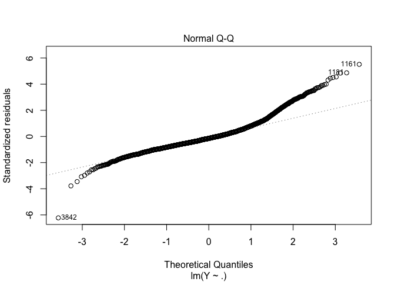<!-- -->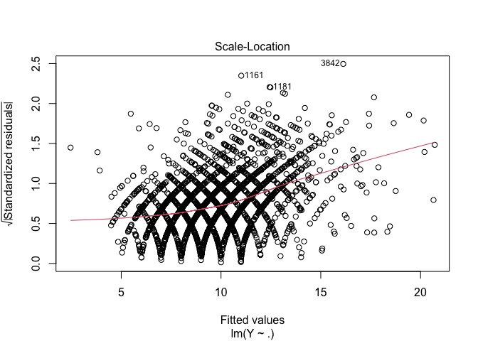<!-- -->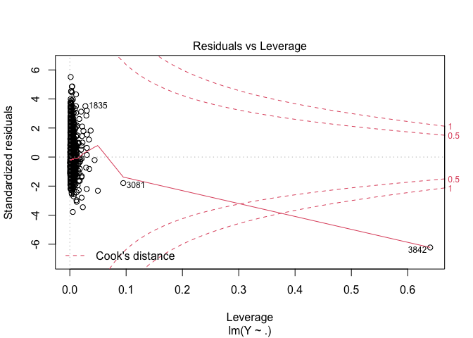<!-- -->


---

# Response transformation

You may use `MASS::boxcox()` to estimate an optimal transformation of the response variable.


```r
#fit linear regression model
box_model<-boxcox(Y~.,data=training_set, lambda=seq(-3,3))
```

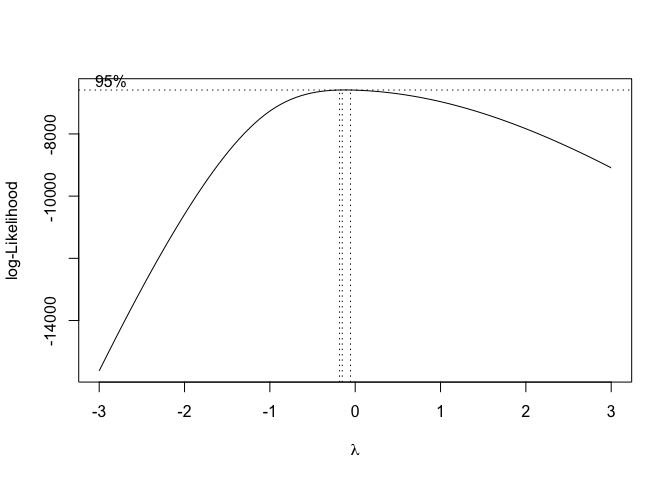<!-- -->


In any case, use the logarithmic transformation (`lambda=0`) and retrain your linear models


```r
lambda <- box_model$x[which.max(box_model$y)]
lambda
```

```
## [1] -0.1515152
```

```r
new_model <- lm(log(Y) ~ .,data=data)
plot(new_model)
```

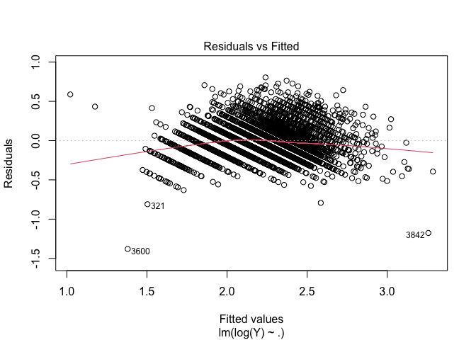<!-- -->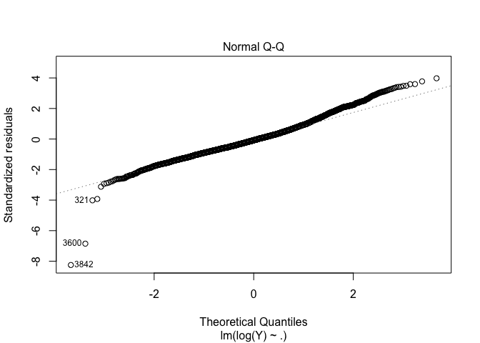<!-- -->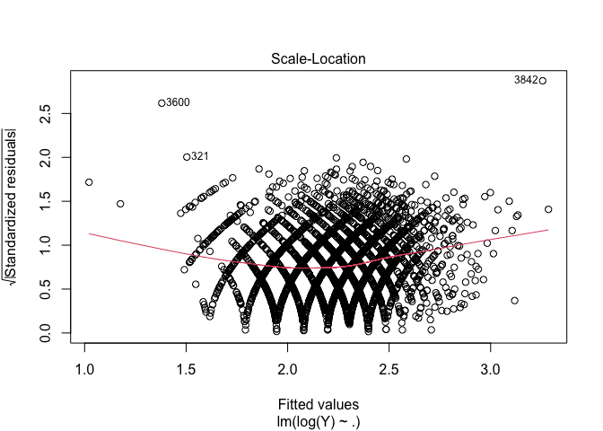<!-- -->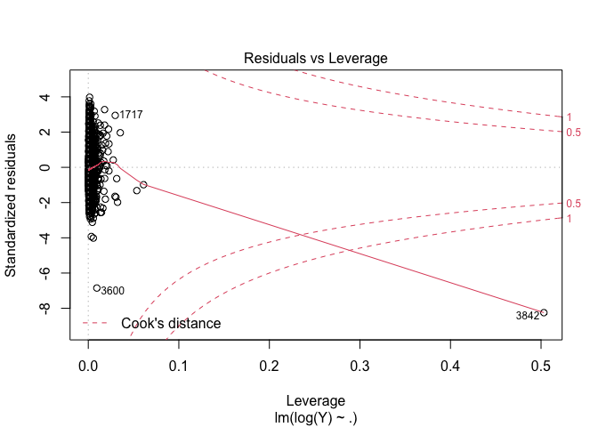<!-- -->


Do the linear models satisfy the Gaussian Linear Modelling assumptions (according to the diagnsotic plots)?

> No linearity whatsoever (cf. Residuals vs Fitted), the line should be straight (at least way straighter). We still don't have the normality of the error (cf. Normal Q-Q) at the begining of the tail the residuals tend to "escape" a lot from the normal line. No homoschedacity whatsoever either. (cf. Scale-Location). So no the linear models don't satisfy the GLM assumptions.


Again, try to pick the model with the best predictive performance


```r
predictions2 <- predict(new_model, newdata = testing_set)
mean((predictions2 - testing_set$Y)^2)
```

```
## [1] 70.67889
```


---

# Combine response transformation and higer order modelling

Use `poly()` to perform linear modelling with respect to powers of the original predictors (up to degree `3`).


```r
polynomial_model <- lm(Y ~ poly(X2, degree=3) + poly(X3, degree=3) + poly(X4, degree=3) + poly(X5, degree=3) + poly(X6, degree = 3) + poly(X7, degree = 3) + poly(X8, degree = 3, raw=T), data = training_set)
summary(polynomial_model)
```

```
## 
## Call:
## lm(formula = Y ~ poly(X2, degree = 3) + poly(X3, degree = 3) + 
##     poly(X4, degree = 3) + poly(X5, degree = 3) + poly(X6, degree = 3) + 
##     poly(X7, degree = 3) + poly(X8, degree = 3, raw = T), data = training_set)
## 
## Residuals:
##      Min       1Q   Median       3Q      Max 
## -10.6445  -1.3053  -0.2963   0.9030  11.7594 
## 
## Coefficients:
##                                  Estimate Std. Error t value Pr(>|t|)    
## (Intercept)                     5.974e+00  8.823e-01   6.771 1.55e-11 ***
## poly(X2, degree = 3)1          -6.732e+01  1.591e+01  -4.232 2.39e-05 ***
## poly(X2, degree = 3)2          -1.074e+01  9.374e+00  -1.146 0.252092    
## poly(X2, degree = 3)3           6.225e+00  6.744e+00   0.923 0.356074    
## poly(X3, degree = 3)1           3.343e+01  1.602e+01   2.087 0.036940 *  
## poly(X3, degree = 3)2           1.242e+00  9.363e+00   0.133 0.894460    
## poly(X3, degree = 3)3           4.784e+00  6.949e+00   0.689 0.491188    
## poly(X4, degree = 3)1           1.830e+01  5.816e+00   3.147 0.001666 ** 
## poly(X4, degree = 3)2          -7.752e+00  3.563e+00  -2.176 0.029652 *  
## poly(X4, degree = 3)3          -2.869e+00  3.955e+00  -0.725 0.468239    
## poly(X5, degree = 3)1           4.108e+02  2.930e+01  14.020  < 2e-16 ***
## poly(X5, degree = 3)2          -1.183e+02  1.841e+01  -6.424 1.56e-10 ***
## poly(X5, degree = 3)3           8.730e+00  8.026e+00   1.088 0.276810    
## poly(X6, degree = 3)1          -3.122e+02  1.477e+01 -21.136  < 2e-16 ***
## poly(X6, degree = 3)2           8.708e+01  9.415e+00   9.249  < 2e-16 ***
## poly(X6, degree = 3)3          -1.425e+01  5.241e+00  -2.718 0.006609 ** 
## poly(X7, degree = 3)1          -7.240e+01  1.124e+01  -6.439 1.42e-10 ***
## poly(X7, degree = 3)2           2.238e+01  7.437e+00   3.010 0.002636 ** 
## poly(X7, degree = 3)3           3.517e+00  4.123e+00   0.853 0.393694    
## poly(X8, degree = 3, raw = T)1  1.468e-01  3.958e-02   3.709 0.000212 ***
## poly(X8, degree = 3, raw = T)2 -1.478e-03  4.822e-04  -3.065 0.002195 ** 
## poly(X8, degree = 3, raw = T)3  6.087e-06  1.807e-06   3.369 0.000765 ***
## ---
## Signif. codes:  0 '***' 0.001 '**' 0.01 '*' 0.05 '.' 0.1 ' ' 1
## 
## Residual standard error: 2.088 on 2762 degrees of freedom
## Multiple R-squared:  0.5706,	Adjusted R-squared:  0.5674 
## F-statistic: 174.8 on 21 and 2762 DF,  p-value: < 2.2e-16
```


Do the linear models satisfy the Gaussian Linear Modelling assumptions (according to the diagnsotic plots)?


```r
plot(polynomial_model)
```

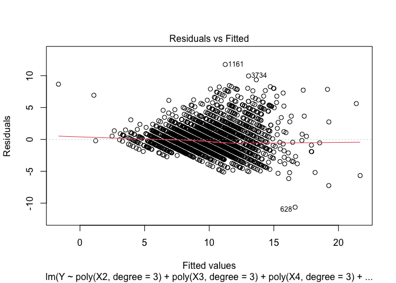<!-- -->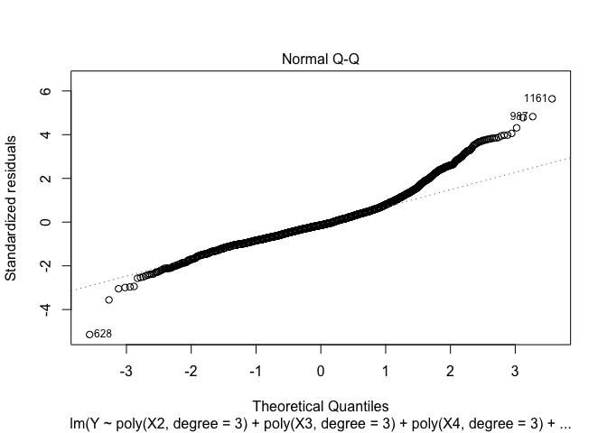<!-- -->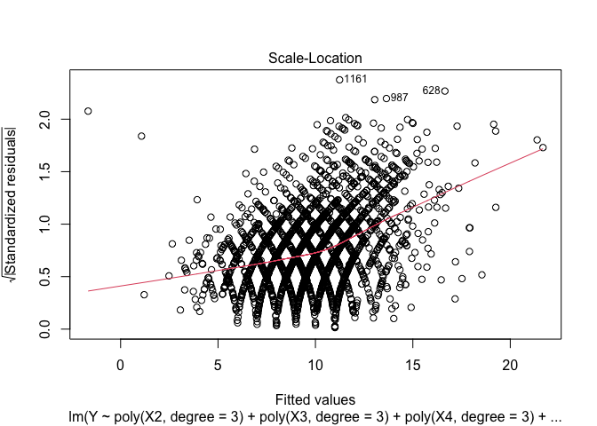<!-- -->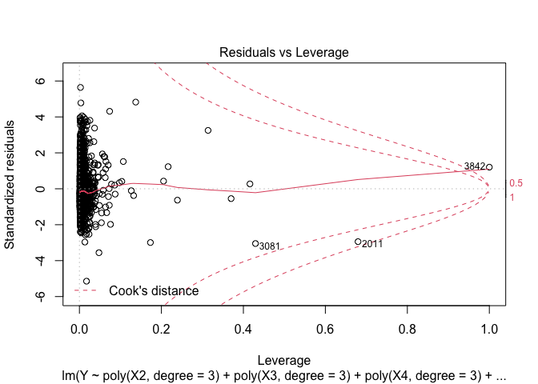<!-- -->

> We now have the linearity of the relationship between predictors and results. The residuals don't look normally distributed. We don't think that the homoscedasticity assumption is verified (cf. Scale-Location)


```r
polynomial_model_with_response_transformation <- lm(log(Y) ~ X1 + poly(X2, degree=3) + poly(X3, degree=3) + poly(X4, degree=3) + poly(X5, degree=3) + poly(X6, degree = 3) + poly(X7, degree = 3) + poly(X8, degree = 3, raw=T), data = training_set)
```


```r
plot(polynomial_model_with_response_transformation)
```

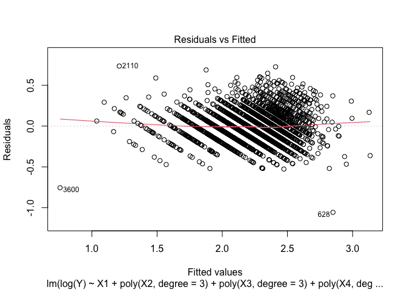<!-- -->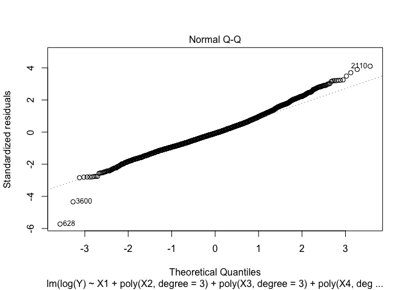<!-- -->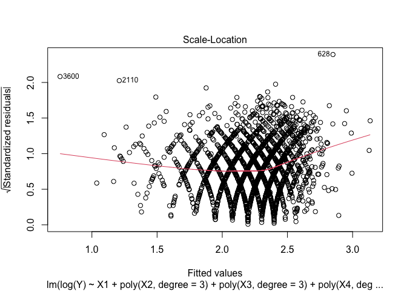<!-- -->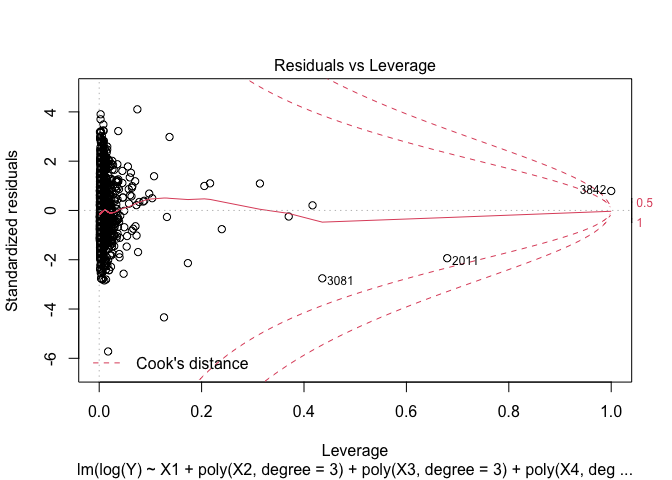<!-- -->
> When we combine the polynomial model and the response transformation we have finally a model that seems to satisfy all the assumptions of the Gaussian Linear Modelling (linearity, homoscedatiscity and normality of the distributions of residuals).


Again, try to pick the model with the best predictive performance


```r
predictions3 <- predict(polynomial_model, newdata = testing_set)
mean((predictions3 - testing_set$Y)^2)
```

```
## [1] 4.909567
```


```r
predictions4 <- predict(polynomial_model_with_response_transformation, newdata = testing_set)
mean((predictions4 - testing_set$Y)^2)
```

```
## [1] 70.6354
```

> In terms of predictions, the polynomial model whitout response transformation is way better than the one with response transformation.
